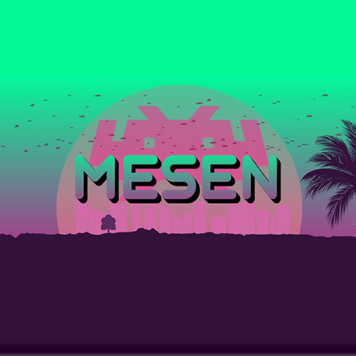

# Nintendo - NES / Famicom (Mesen)

### Description

Mesen is a high-accuracy NES emulator for Windows and Linux.

Mesen offers numerous features, such as save states, video filters, netplay, rewinding, overclocking, cheat codes and HD packs.

### License

GPLv3

### Icon

### Fanart

Help make me fanart!

### Screenshots

